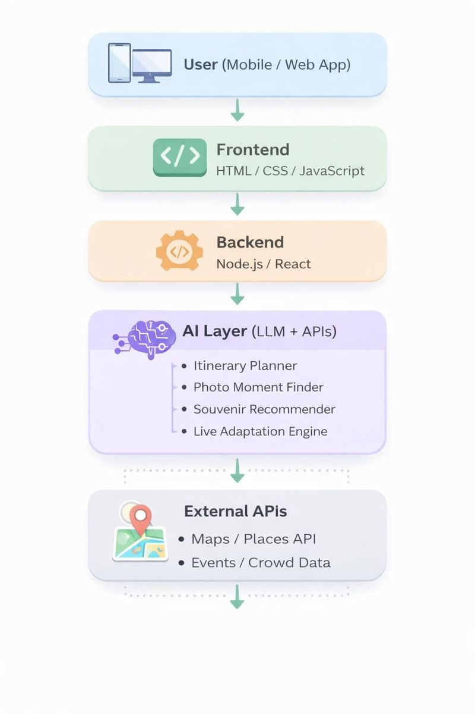

  # Next-Gen Travel Companion

  # Title

IN-IN (Inside India)
A Next-Gen Travel Companion

  # Problem Statement

Existing travel apps prioritize logistics over experience.
They offer static, one-size-fits-all recommendations.
There is no emotional, cultural, or contextual understanding.
Travelers reach destinations but miss meaningful connections.

  # Simple Architecture design

  # Tech Stack

✔️Frontend: HTML, CSS, JavaScript
✔️Backend:Node.js,React
✔️Logic Handling: JavaScript
✔️AI: open AI GPT,Figma AI
✔️Deployment: Local Browser, GitHub Pages

  # Setup instructions

  For install: use npm i(dependencies)
  To run the program: npm run dev

  # Ai tools used

•ChatGPT (for ideation, content structuring, and feature planning)
•AI-assisted prompt design for travel recommendations
•Figma AI for frame works and designs

  # Project strategy summary

IN-IN uses a structured and context-aware prompt strategy to provide personalized travel experiences.
User inputs like location, budget, time, mood, and preferences are combined into one clear prompt.
The AI is guided to focus on Indian culture, local experiences, emotions, and safety, not generic tourism.

Different prompt templates are used for:

  →Itinerary planning

  →Best photo time and spots

  →Local food and souvenir suggestions

  →Real-time updates based on crowd, events, and time

Each prompt follows a simple flow:
User Context → Travel Intent → Constraints → Desired Experience, ensuring meaningful and relevant results.

  # Final Output

A fully functional browser-based travel assistant that:

  –Suggests best photo spots and timings

  –Recommends authentic food and local souvenirs

  –Provides emotion-based travel guidance

  –Shows nearby facilities and emergency support

  –Enhances meaningful travel experiences in India

  # Build Reproducibility instructions

The project follows a client–server architecture using modern web technologies.

To reproduce the build locally:

1.Clone the GitHub repository.

2.Install required dependencies using npm install.

3.Add required API keys (if any) as environment variables.

4.Start the development server using npm start.

5.Open the application in a web browser.

The project runs locally without any paid services, and all core features can be tested by the judges using the provided setup instructions.

